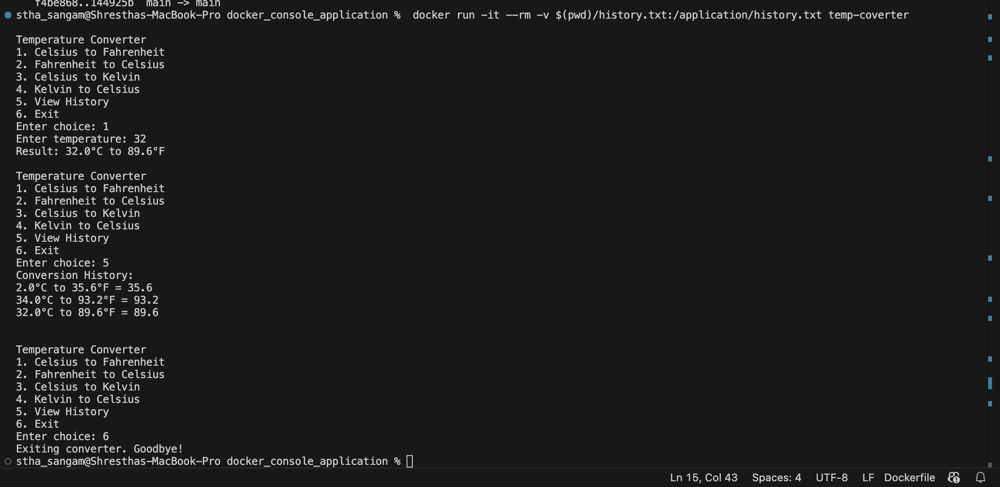

# Temperature Converter Docker Application

This is a Python-based temperature converter that supports conversion between Celsius, Fahrenheit, and Kelvin, storing history using Docker volumes.

## Setup Instructions
1. Clone the Repository:
   ```
   https://github.com/sangamsthxa/Temperature-Converter-Application.git
   ```
2. Build the Docker image:
   ```
   docker build -t temp-converter .
   ```
3. Run the container with a mounted volume for persistence:
   ```
   docker run -it --rm -v $(pwd)/history.txt:/application/history.txt temp-coverter
   ```

## Features
- Convert temperature between Celsius, Fahrenheit, and Kelvin.
- View history stored in a mounted volume.

## Usage
- Follow on-screen instructions to perform conversions.
- View history by selecting the appropriate option.
- The conversion history is saved in `/history.txt` on your host machine.

## Docker Concepts Used
- **Base Image**: Uses `python:3.9-slim` as the base image.
- **Copy Command**: The Dockerfile copies the Python script and history file from the host machine to the container's /  application directory, ensuring the application and its data are available inside the container.
- **Volume Mounting**: Mounts `./application` directory for persistent history storage.
- **CMD Instruction**: Sets `python temperature_converter.py` as the default execution command.

## Screenshots of Application Running


```